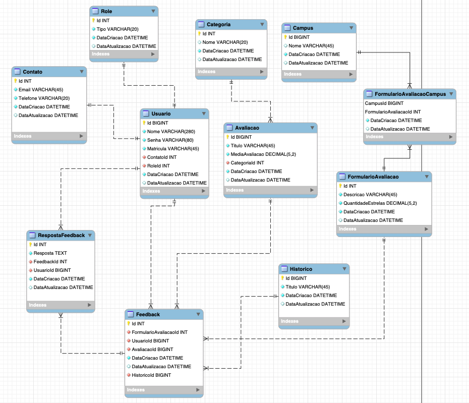

# IFeedS - Feedback para o Instituto Federal de Sergipe

### RESUMO/JUSTIFICATIVA

Desenvolver uma aplicação web que fornecerá à comunidade acadêmica a possibilidade de 
reportar e dar feedbacks referente a estrutura organizacional. A comunidade terá a 
possibilidade de informar por meio da aplicação a necessidade de melhorias, ajustes, e 
também, fazer elogios sobre serviços, infraestrutura e eventos da instituição.

### OBJETIVOS

- O aplicativo irá funcionar como um captador de dados.
- O objetivo do aplicativo é simples, ele resolve o problema de fazer o IFS entender o que precisa melhorar de fato e dá uma transparência para todos de como o instituto caminha.

## REGRAS DE NEGÓCIO

- O usuário deverá ter vínculo com Instituto atravéz da matrícula;
- O usário deverá realizar um cadastro para estar habilitado a usar o sistema;
- Ao realizar avaliação, o usuário deverá atribuir uma nota entre 0 e 5;
- O formulário de avaliação obrigatoriamente deverá conter a descrição para finalizar o Feedback.

## FUNCIONALIDADES

- [ ] Perfis de usuários(admin, usuário comum);
- [ ] CADASTRO de usuários;
- [ ] CADASTRO de avaliações; 
- [ ] Realizar Feedback;
- [ ] Armazenar históricos de Feedbck; 
- [ ] CADASTRO das categorias;
- [ ] Analisar e/ou responder feedback;
- [ ] Preencher formulário de avaliação;
- [ ] CADASTRAR infomrações de contato do usuário;
- [ ] CADASTRO de Campus.

### REQUISITOS NÃO FUNCIONAIS

- Utilizar .NET CORE 5
- Utilizar [EF Core](https://docs.microsoft.com/pt-br/ef/core/) para manipução de dados
- Possuir, pelo menos três, relacionamentos 1:1 (um para um)
- Possuir, pelo menos três, relacionamentos 1:N (um para muitos)
- Possuir, pelo menos um, relacionamento M:N (muito para muitos)
- Fazer um programa, em C# com Entity Framework, para realizar carga inicial dos dados
- Utilizar campos de data, numéricos e textuais

## Membros da equipe

- Vanilton Filho (líder)
- Kaiki Mello
- Rafaela Passos

## DER

## Dicas, repositórios e materiais úteis

- https://github.com/CBSIIFSLagarto/2021_1_web2
- Documentação sobre [Diretrizes de design de estrutura] 
- [A collection of awesome **.NET CORE** libraries, tools, frameworks, and software](https://github.com/thangchung/awesome-dotnet-core)
- [A collection of awesome **.NET** libraries, tools, frameworks, and software](https://github.com/quozd/awesome-dotnet) - Referência, pois é para .NET e não .NET CORE
- Banco de dados
  - [Sqlserver e docker: um guia instantâneo](sqlserver_e_docker.md)
  - *Migrations*
    - [Visão geral](https://docs.microsoft.com/pt-br/ef/core/managing-schemas/migrations/?tabs=dotnet-core-cli)
    - [Exemplo: aplicação de uma *migration*](https://docs.microsoft.com/pt-br/aspnet/core/data/ef-mvc/migrations?view=aspnetcore-3.1)
  - Carga de dados iniciais (*seed data*)
    - [Data seeding]
    - [migrations/seeding](https://www.learnentityframeworkcore.com/migrations/seeding)
- Globalização
  - [Usar (",") como separador decimal](https://github.com/dotnet/AspNetCore.Docs/issues/4076#issuecomment-326590420)
  - [Vários idiomas](https://docs.microsoft.com/pt-br/aspnet/core/fundamentals/localization?view=aspnetcore-5.0)
- Tela
  - [Como filtrar por categoria](https://docs.microsoft.com/pt-br/aspnet/core/tutorials/first-mvc-app/search?view=aspnetcore-5.0)
  - [Gerenciamento de estado e sessão](https://docs.microsoft.com/pt-br/aspnet/core/fundamentals/app-state?view=aspnetcore-5.0)

### Gerenciar seu trabalho no GitHub

O github contém várias ferramentas que permitem o gerenciamento projeto, promovendo entre outros recursos a rastreabilidade e o gerenciamento das atividades. Saiba mais nos links abaixo.

- [Gerenciar seu trabalho no GitHub](https://docs.github.com/pt/free-pro-team@latest/github/managing-your-work-on-github)
- [Closing issues using keywords](https://docs.github.com/en/enterprise/2.16/user/github/managing-your-work-on-github/closing-issues-using-keywords)
- [Vinculando uma pull request a um problema](https://docs.github.com/pt/free-pro-team@latest/github/managing-your-work-on-github/linking-a-pull-request-to-an-issue)
- [GitHub: How can I close the two issues with commit message?](https://stackoverflow.com/questions/60027222/github-how-can-i-close-the-two-issues-with-commit-message) 

## Prazo

Data | Descrição
:---:|:---
10/06/2021 | Definição do projeto a ser executado
28/06/2021 | Apresentar o modelo conceitual da solução proposta
12/07/2021 | [Modelo implementado](https://docs.microsoft.com/pt-br/ef/core/modeling/) no EF Core
15/07/2021 | Aplicação que permite a [carga incial/teste][Data seeding] do modelo implementado com EF Core
??/??/???? | Entrega de [protótipos](prototipos/prototipos.md) das principais telas do sistema proposto (e que atendam aos itens descritos no REQUISITOS NÃO FUNCIONAIS)

## Project status
Este projeto é um template para a definição da avaliação da disciplina programação web 2, do período de 2021.1 (aulas remotas), do IFS

[Diretrizes de design de estrutura]: https://docs.microsoft.com/pt-br/dotnet/standard/design-guidelines/
[Data seeding]: https://docs.microsoft.com/en-us/ef/core/modeling/data-seeding
